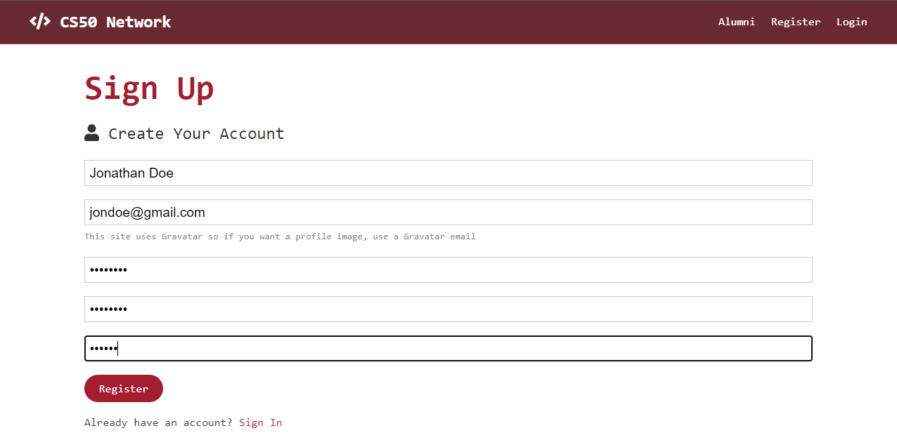
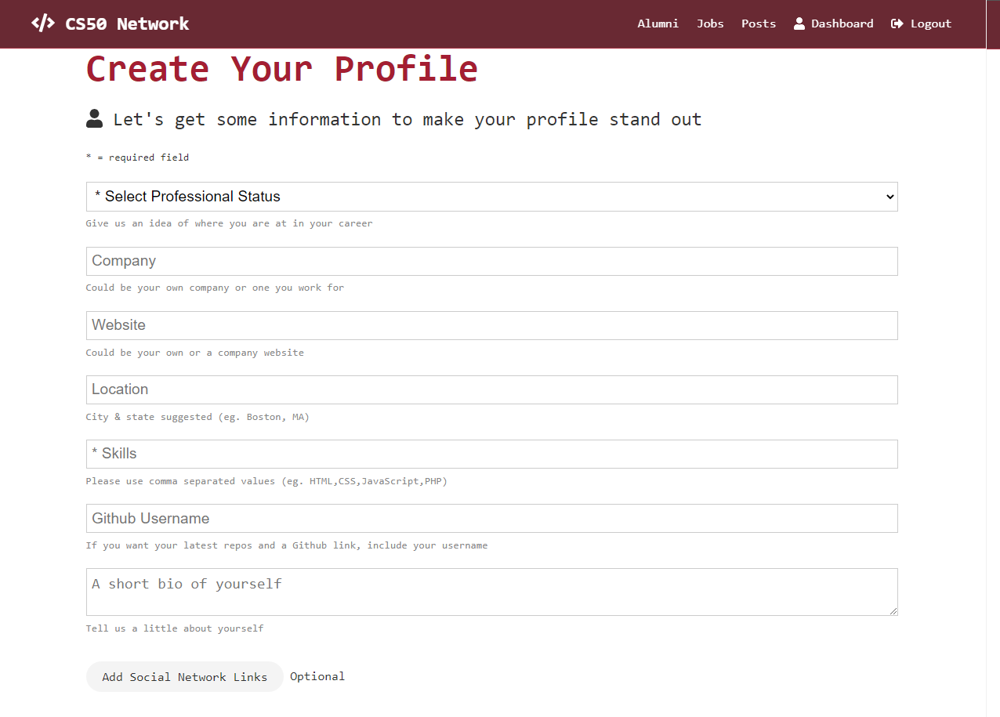
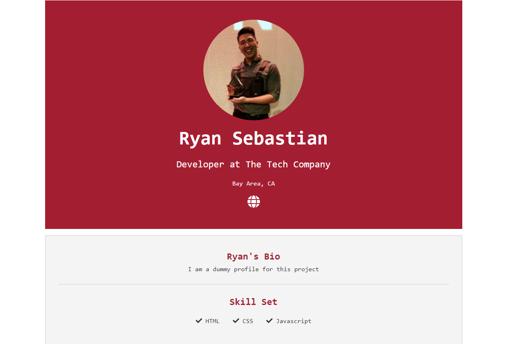

# CS50 Network

This social media web app was built as a final project for CS50, Web Development track at Harvard University. The purpose of this app is for users to make accounts, create profiles showcasing their skillset, and connect with each other.

## Tech Stack

**Client:** React, Redux, BootstrapCSS

**Server:** Node, Express, MongoDB

## Deployment

This project is currently deployed at https://quiet-journey-29557.herokuapp.com/. Heroku is removing its free tier soon, so I will update the URL once its deployed to a different site.

## Screenshots

Register User

CS50 token would ideally be a token sent by Harvard after verifying completion of the C50 program. For this experimental site, enter any string at least 6 characters long

Create Profile

Enter your information and create a profile like below

## Acknowledgements

- [Brad Traversy](https://www.traversymedia.com/) - His [course](https://www.udemy.com/share/101WIo3@NZkCOyc6kGMeWC5g1wq60oZAcAPuQraAOPFK-dwSmbAWmSvL-yPOIfTlSF3XAhV5/) was extremely helpful for helping me understand how to utilize the MERN stack to create a working application. The inital code from this course was used as a foundation with additional features like job postings were features I implemented.
